<p align="center">
  
</p>

# lg5-spring-agent-os

<p align="center">
  
  
</p>

> Versioned **agent operating system** for building microservices on top of the
> [`lg5-spring`](https://github.com/lg-labs-pentagon/lg5-spring) framework.

This repository ships a curated, validated set of **agent context artifacts**
— the things AI coding agents (OpenCode, Claude Code, Cursor, Continue,
Copilot, etc.) need to be productive on services that follow the lg5-spring
conventions.

Current bundle: **v4.5.1** · Validated against `lg5-spring` SHA: **`d0d754a`**.

---

## What's inside

```
lg5-spring-agent-os/
├── AGENTS.md                                  # always-loaded index + skill routing table + rule cheat sheet
├── manifest.yaml                              # SINGLE SOURCE OF TRUTH for bundle version & SHA
├── skills/                                    # 7 thematic skills (load on demand)
│   ├── CHANGELOG.md
│   ├── lg5-spring-overview/SKILL.md
│   ├── lg5-new-service/SKILL.md
│   ├── lg5-saga/SKILL.md
│   ├── lg5-outbox/SKILL.md
│   ├── lg5-kafka-avro/SKILL.md
│   ├── lg5-atdd/SKILL.md
│   └── food-ordering-system/SKILL.md
├── rules/                                     # 18 always-active hard rules (15 form the constitution)
│   ├── CHANGELOG.md
│   ├── CONSTITUTION.md                        # index of constitutional rules + rules of engagement
│   └── RULE-001-stack-baseline.md … RULE-018-reference-projects.md
├── commands/                                  # 17 slash commands (9 SDD orchestrators + 8 building-blocks)
│   ├── CHANGELOG.md
│   ├── sdd-specify.md                         # SDD: informal prompt → PRD
│   ├── sdd-plan.md                            # SDD: PRD → plan + ADRs + data-model
│   ├── sdd-tasks.md                           # SDD: plan → atomic TASK-NNN
│   ├── sdd-implement.md                       # SDD: execute one TASK-NNN end-to-end
│   ├── scaffold-service.md
│   ├── add-saga.md
│   ├── add-outbox.md
│   └── add-kafka-listener.md
├── subagents/                                 # 14 specialized subagents (including 2 Primary)
│   ├── CHANGELOG.md
│   ├── sdd.md                                 # Primary orchestrator agent (Tab-discoverable)
│   ├── quick.md                               # Primary quick-path agent (Tab-discoverable)
│   ├── lg5-code-reviewer.md
│   ├── lg5-test-generator.md
│   ├── lg5-ci-cd-engineer.md
│   ├── sdd-specifier.md
│   ├── sdd-planner.md
│   ├── sdd-tasker.md
│   └── sdd-implementer.md
├── specs/                                     # spec-driven workflow templates + examples
│   ├── CHANGELOG.md
│   ├── README.md                              # SDD workflow overview
│   ├── templates/
│   │   ├── prd-template.md
│   │   ├── adr-template.md
│   │   ├── plan-template.md
│   │   ├── tasks-template.md
│   │   ├── data-model-template.md
│   │   └── research-template.md
│   └── examples/loyalty-ledger/               # end-to-end SDD example (PRD+plan+tasks+ADRs+data-model)
├── scripts/
│   ├── validate.sh                            # CI / local sanity checks for all artifact types
│   └── install.sh                             # install into a consumer repo
├── .github/workflows/validate.yml             # CI runs validate.sh on push/PR
├── .github/workflows/release.yml              # Automated release pipeline (tags + GH releases)
├── CONTRIBUTING.md
└── LICENSE
```

### Artifact type cheat sheet

| Artifact   | Format                                                  | When loaded         | What it does                                                  |
|------------|---------------------------------------------------------|---------------------|---------------------------------------------------------------|
| **rule**     | `<RULE-ID>-<slug>.md` with frontmatter (id, severity, scope) | Always-active   | Hard constraints, cited in PR review by stable ID.            |
| **skill**    | `<dir>/SKILL.md` with frontmatter                      | On demand by topic  | Deep recipes (saga, outbox, kafka, atdd, scaffolding, …).     |
| **command**  | `<name>.md` with frontmatter (description, argument-hint, allowed-tools) | On user `/invocation` | Repeatable workflows (scaffold service, add saga, etc.).  |
| **subagent** | `<name>.md` with frontmatter (name, description, tools, model) | Spawned by orchestrator | Delegated specialists (code-reviewer, test-generator, planner). |
| **spec**     | `<name>.md` with frontmatter (kind, name, version)     | Read at planning time | PRD/ADR templates + example spec for spec-driven workflow.   |

### Inventory at v4.5.1

- **18 rules** (15 constitutional / `severity: must`, 2 `should`, 1 `info`).
  Scopes: framework (4), architecture (5), kafka (2), outbox (2), saga (1),
  testing (2), style (1), build (1), reference (1). Indexed in
  [`rules/CONSTITUTION.md`](rules/CONSTITUTION.md).
- **11 skills** (`lg5-spring-overview`, `lg5-new-service`, `lg5-saga`,
  `lg5-outbox`, `lg5-kafka-avro`, `lg5-atdd`, `food-ordering-system`,
  `lg5-github-actions`, `lg5-api-docs`, `lg5-allure-report`, `lg5-vitepress-docs`).
- **17 commands**:
  - 9 SDD orchestrators (`/sdd-intent`, `/sdd-specify`, `/sdd-plan`, `/sdd-design`, `/sdd-tasks`, `/sdd-implement`, `/sdd-verify`, `/sdd-orchestrate`, `/sdd-quick`)
  - 8 building blocks (`/scaffold-service`, `/add-saga`, `/add-outbox`, `/add-kafka-listener`, `/scaffold-ci-cd`, `/scaffold-docs`, `/add-rest-endpoint`, `/add-jpa-entity`)
- **14 subagents**:
  - 2 Primary orchestrators (`sdd`, `quick`) — discoverable via **Tab**.
  - 3 cross-cutting (`lg5-code-reviewer`, `lg5-test-generator`, `lg5-ci-cd-engineer`)
  - 9 SDD phase specialists (`sdd-intender`, `sdd-specifier`, `sdd-planner`, `sdd-designer`, `sdd-tasker`, `sdd-implementer`, `sdd-verifier`, `sdd-orchestrator`, `sdd-quicker`).
- **6 spec templates + 1 worked example**: `prd-template`, `plan-template`,
  `tasks-template`, `data-model-template`, `adr-template`, `research-template`,
  plus the end-to-end [`examples/loyalty-ledger/`](specs/examples/loyalty-ledger/)
  spec set.
- All artifacts validated against `lg5-spring` SHA `d0d754a`.

---

## Spec-Driven Development workflow

This bundle implements the **spec-anchored** SDD variant described by
[Fowler & Böckeler](https://martinfowler.com/articles/exploring-gen-ai/sdd-3-tools.html),
borrowing the four-phase command chain from
[GitHub spec-kit](https://github.com/github/spec-kit). Specs live alongside
the code they describe, are kept in sync with it, and remain editable —
they are not the single source of truth (which is still the code), but they
are the single source of **intent**.

```
   /sdd-specify     /sdd-plan         /sdd-tasks        /sdd-implement
       │                │                  │                  │
       ▼                ▼                  ▼                  ▼
     prd.md   ──►  plan.md + adr/  ──►  tasks.md   ──►   code + tests
                  + data-model.md       (TASK-NNN)        + commit (loop)
   (functional)   (technical)           (atomic)
       │                │                  │                  │
       └─ HUMAN ────────┴────── HUMAN ─────┴── HUMAN ────────►
          APPROVES        APPROVES          APPROVES
```

Per-feature artifacts live in the **consumer** repo at
`docs/specs/<NNN-slug>/` (e.g. `001-loyalty-ledger/`):

```
docs/specs/001-loyalty-ledger/
├── prd.md            # functional requirements (REQ-NNN), no technology
├── plan.md           # module map, dep graph, risks
├── tasks.md          # atomic TASK-NNN with Given/When/Then AC
├── data-model.md     # aggregates, events, outbox, REST DTOs, Avro, JPA
├── research.md       # (optional) time-boxed spike notes
└── adr/
    ├── ADR-001-<slug>.md
    └── ADR-002-<slug>.md
```

Approval gates exist **between phases**, not between individual TASKs.
Inside Build, `/sdd-implement TASK-NNN` is invoked per task and produces
exactly one commit (`feat(TASK-NNN): <title>`).

Read [`specs/README.md`](specs/README.md) for the full workflow guide and
[`specs/examples/loyalty-ledger/`](specs/examples/loyalty-ledger/) for an
end-to-end worked example.

### Constitution

The 15 rules with `severity: must` form the **constitution**: immutable
constraints that bind every PRD/Plan/Task/code change. ADRs that override a
constitutional rule must justify the override and time-box the deviation.
See [`rules/CONSTITUTION.md`](rules/CONSTITUTION.md).

---

## Why "agent OS"?

We follow the emerging convention (BuilderMethods'
[`agent-os`](https://github.com/buildermethods/agent-os), Anthropic's
[Agent Skills](https://www.anthropic.com/news/agent-skills)) of treating
these artifacts as a unified **operating layer** for AI agents — analogous
to how a traditional OS bundles kernel + shell + utilities + drivers. Naming
the repo after a single artifact type (`-skills`, `-rules`) would lock us in.

---

## Versioning

Follows [Semantic Versioning 2.0.0](https://semver.org/spec/v2.0.0.html):

- **MAJOR** — breaking re-organization (artifact renames/deletions, removal
  of mandatory rules, change in install layout).
- **MINOR** — new artifact, new artifact type, new section in an existing
  artifact, validation against a new framework SHA.
- **PATCH** — clarifications, anti-pattern additions, no recipe change.

Every release is tagged (`v4.4.0`, `v4.4.1`, …) and pinned to a single
`lg5-spring-sha`. The `bundle.lg5-spring-sha` and `bundle.version` are
defined in the root `manifest.yaml` (SINGLE SOURCE OF TRUTH).

### Compatibility matrix

| Bundle version | lg5-spring SHA | Released   | Highlights |
|---------------:|----------------|------------|------------|
| `0.1.0`        | `cbb6783`      | 2026-05-09 | 7 skills only; bundle name `lg5-spring-skills`. |
| `0.2.0`        | `cbb6783`      | 2026-05-09 | Rebranded to `lg5-spring-agent-os`; added 18 rules + 4 commands + 3 subagents + 2 spec templates + 1 example spec. Same skill content as 0.1.0. |
| `0.3.0`        | `cbb6783`      | 2026-05-09 | SDD adoption: `CONSTITUTION.md` + `constitutional` rule frontmatter; 4 SDD orchestrator commands (`/sdd-{specify,plan,tasks,implement}`); specs reorg into `templates/` + per-feature folder example (`loyalty-ledger`); 4 new templates (plan/tasks/data-model/research). No skill content changes. |
| `0.3.1`        | `af81c7c`      | 2026-05-10 | PATCH: framework SHA pin bumped to honor RULE-001's Spring Boot 3.4.2 mandate (`cbb6783` actually shipped 3.3.5; discovered during consumer-service TASK-002 of `lg5-loyalty-ledger`). `af81c7c` bundles the Spring Boot 3.4.2 upgrade (`e5139d0`), `ConfluentKafkaContainerCustomConfig` (`5fb16aa`), and CI/docs updates. No rule/skill/command/subagent/spec contracts changed. |
| `0.3.2`        | `d0d754a`      | 2026-05-10 | PATCH: framework SHA pin bumped to ship the [`ConfluentKafkaContainerCustomConfig` in-network Kafka listener fix](https://github.com/lg-labs-pentagon/lg5-spring/pull/1) — companion containers (Schema Registry, app-in-container) can now reach the broker via `kafka:19092` instead of the host-mapped `localhost:<random-port>`. Also pulls in [LG-83] Jib Maven plugin upgrade to 3.5.1 (transitive on the framework parent pom). Surfaced while wiring the first downstream Kafka listener IT in `lg5-loyalty-ledger` TASK-009. No rule/skill/command/subagent/spec contracts changed. |
| `0.3.3`        | `d0d754a`      | 2026-05-10 | PATCH (early-access for new artifact type): added 3 CI/CD skills (`lg5-github-actions`, `lg5-api-docs`, `lg5-allure-report`) + `/scaffold-ci-cd` command. Promoted from `blank-service`'s reference CI pipeline (canonical 11-job topology + `setup-maven-credentials` composite action + Swagger UI / AsyncAPI doc renderers + Allure Cucumber7 wiring). PATCH chosen intentionally so consumers battle-test before promotion to a MINOR. |
| `0.3.4`        | `d0d754a`      | 2026-05-10 | PATCH (security): pinned `NBprojekt/gource-action@v1.2.1` to commit SHA `d2fdf85904db416b69445dae5551282528e052ae` in the `lg5-github-actions` skill template (skill bumped 0.1.0 → 0.1.1). Closes Codacy/OpenSSF-Scorecard finding for unpinned third-party action. |
| `0.3.5`        | `d0d754a`      | 2026-05-10 | MINOR-equivalent shipped as PATCH (early-access cadence): added subagent `lg5-ci-cd-engineer` (v0.1.0) — CI/CD specialist that loads the 3 CI/CD skills on demand and declares an explicit out-of-scope section listing 8 future skills (container delivery, k8s manifests, GitOps, release automation, secrets, env promotion, perf pipelines, quality gates) per RULE-018. |
| `0.3.6`        | `d0d754a`      | 2026-05-10 | PATCH (tooling-only): added `scripts/dev-link.sh` to self-host the bundle for OpenCode in the upstream working tree via `.opencode/` symlinks. No artifact contract changes; consumer upgrade unnecessary. |
| `1.0.0`        | `d0d754a`      | 2026-05-10 | **MAJOR (install layout change).** Bundle is now consumed as a single git submodule mounted at `.agent-os/` (was `.lg5-agent-os/` with copy to `.agent-os/`). `install.sh` no longer copies — it materializes `.opencode/` symlinks into `.agent-os/`. Removed Modes B (plain copy) and C (sparse checkout); only the submodule mode is supported. Removed `scripts/dev-link.sh` (logic absorbed into `install.sh`, which auto-detects consumer vs. self-host mode). See `skills/CHANGELOG.md` for the migration guide. |
| `4.4.0`        | `d0d754a`      | 2026-06-09 | **Centralized Versioning & Primary Agents.** Moved all versions to root `manifest.yaml`. Introduced Primary agents `sdd` and `quick` for better discoverability. Automated release pipeline via GitHub Actions. |
| `4.4.3`        | `d0d754a`      | 2026-06-09 | **Fixes.** Updated `scripts/validate.sh` and `scripts/install.sh` to use the root manifest. Unified versions across all Skill and Rule artifacts. |
| `4.5.0`        | `d0d754a`      | 2026-06-09 | **Upgrade capability.** Added `--upgrade` flag to `install.sh` to easily update the bundle to the latest stable tag in consumer services. |
| `4.5.1`        | `d0d754a`      | 2026-06-10 | **New Identity.** Added a new animated SVG logo representing the Agent Operating System. Updated docs theme and index. |

---

## How to consume from a microservice repo

The bundle is consumed as a **git submodule** mounted at `.agent-os/` in the
consumer repo. The submodule itself is the source of truth — artifacts are
**not** copied. `install.sh` materializes a `.opencode/` directory of
relative symlinks that point back into `.agent-os/`, which is what OpenCode
actually loads at runtime.

```bash
cd your-microservice-repo

# 1. Add the bundle as a submodule at .agent-os/
git submodule add -b main git@github.com:lg-labs-pentagon/lg5-spring-agent-os.git .agent-os

# 2. Pin to a release (e.g., v4.5.1)
git -C .agent-os checkout v4.5.1

# 3. Wire OpenCode (creates .opencode/ symlinks + adds .opencode/ to .gitignore)
.agent-os/scripts/install.sh

# 4. Commit the submodule pin
git add .gitmodules .agent-os .gitignore
git commit -m "chore(agent-os): pin lg5-spring-agent-os@v4.5.1"
```

**After fresh clone** (the only manual step): `git submodule update --init`
followed by `.agent-os/scripts/install.sh` (re-creates the symlinks; safe
to run anytime — idempotent).

**Upgrades**: Simply run `.agent-os/scripts/install.sh --upgrade` to move to the latest stable tag and refresh links in one step.

### Resulting consumer layout

```
your-microservice-repo/
├── .agent-os/                  ← git submodule (HEAD-detached at vX.Y.Z, COMMITTED)
│   ├── skills/
│   ├── commands/
│   ├── subagents/
│   ├── rules/
│   ├── specs/
│   ├── AGENTS.md               ← bundle-shipped rules/routing
│   └── scripts/install.sh
│
├── .opencode/                  ← generated, GITIGNORED
│   ├── skills/                 ← real dir; one symlink per skill subdir
│   │   ├── lg5-saga    -> ../../.agent-os/skills/lg5-saga
│   │   └── …
│   ├── commands/               ← real dir; one symlink per .md
│   │   ├── sdd-plan.md -> ../../.agent-os/commands/sdd-plan.md
│   │   └── …
│   ├── agents/                 ← real dir; one symlink per .md (OpenCode's naming)
│   │   ├── sdd-planner.md -> ../../.agent-os/subagents/sdd-planner.md
│   │   └── …
│   └── AGENTS.md -> ../.agent-os/AGENTS.md
│
├── AGENTS.md                   ← consumer's own AGENTS.md (per-repo overrides)
└── …
```

OpenCode reads BOTH `<repo-root>/AGENTS.md` (consumer overrides) and
`.opencode/AGENTS.md` (bundle-shipped, via symlink). The consumer's root
`AGENTS.md` takes precedence.

> Bundle housekeeping files (`CHANGELOG.md`, `manifest.yaml`, `.DS_Store`)
> are filtered out of `.opencode/{agents,commands,skills}/` by `install.sh`
> (≥ `4.1.1`) so they never surface as phantom agents in OpenCode's
> `@`-mention picker — see [issue #15](https://github.com/lg-labs-pentagon/lg5-spring-agent-os/issues/15).

### How to invoke bundle agents

All bundle subagents have `mode: subagent`, so:

- **Tab** in OpenCode cycles **primary** agents only (Build, Plan, custom).
  Bundle subagents do not show up there.
- Use **`@<name>`** from a primary chat to invoke a bundle subagent:
  `@sdd-planner help me plan feature 001`.
- In practice the `/sdd-*` slash commands dispatch to the right subagent
  automatically — you usually only `@`-mention the three cross-cutting
  ones (`lg5-code-reviewer`, `lg5-test-generator`, `lg5-ci-cd-engineer`)
  for ad-hoc work outside the SDD flow.

See [opencode.ai/docs/agents](https://opencode.ai/docs/agents/) for the
upstream `primary` vs `subagent` discoverability model. Full discussion
in [`AGENTS.md`](AGENTS.md#how-to-invoke-the-bundles-agents).

---

## Validation

```bash
bash scripts/validate.sh
```

The validator runs one check function per artifact type that exists on
disk, plus cross-bundle invariants. Specifically:

- **skills** — `SKILL.md` + `CHANGELOG.md` per dir; YAML frontmatter
  (`name`, `version`, `lg5-spring-sha`, `description`); SemVer; name ↔
  directory match; versions & SHA must match root `manifest.yaml`; no
  forbidden `/tmp/` paths in fenced code blocks (only `/tmp/lg5-study/`
  is allowed).
- **rules** — `RULE-NNN-<slug>.md` files; frontmatter (`id`, `slug`,
  `version`, `lg5-spring-sha`, `severity`, `scope`, `tags`, `description`);
  filename ↔ id+slug match; versions & SHA must match root `manifest.yaml`;
  severity ∈ {`must`, `should`, `info`}.
- **commands** — `<name>.md` files; frontmatter (`description`,
  `argument-hint`, `allowed-tools`).
- **subagents** — `<name>.md` files; frontmatter (`name`, `description`,
  `tools`); name ↔ filename match.
- **specs** — templates and examples; frontmatter (`kind`, `name`,
  `version`, `description`); kind ∈ {`template`, `example`}.
- **cross-bundle** — root `manifest.yaml` exists and defines global version/SHA.

Optional install-output lint (regression test for issue #15):

```bash
bash scripts/validate.sh --install
```

This runs `scripts/install.sh` against a disposable temp fixture (fake
consumer repo with `.agent-os/` symlinked to the bundle) and asserts that
`.opencode/{agents,commands,skills}/` are real directories containing no
housekeeping files (`CHANGELOG.md`, `manifest.yaml`, `.DS_Store`) and that
every `.md` under `agents/` and `commands/` has YAML frontmatter. Gated
behind `--install` because it materializes a temp filesystem (slower).

The same script runs in CI on every push and PR
(`.github/workflows/validate.yml`).

---

## Contributing

See [CONTRIBUTING.md](./CONTRIBUTING.md). TL;DR:

1. Branch off `main`.
2. Add or modify an artifact (mirror the existing structure for that type).
3. Update the relevant `<type>/CHANGELOG.md` and (if bumping the artifact's
   own version) the root `manifest.yaml`.
4. If this is a bundle-wide release, bump `bundle.version` in the root
   `manifest.yaml` and add a top-level entry in this README's
   compatibility matrix.
5. Run `bash scripts/validate.sh` until green.
6. Open a PR with a Conventional Commits title (e.g. `feat(rules): add
   RULE-019 …`).
7. Maintainer tags a new bundle release after merge.

---

## License

See [LICENSE](./LICENSE).
