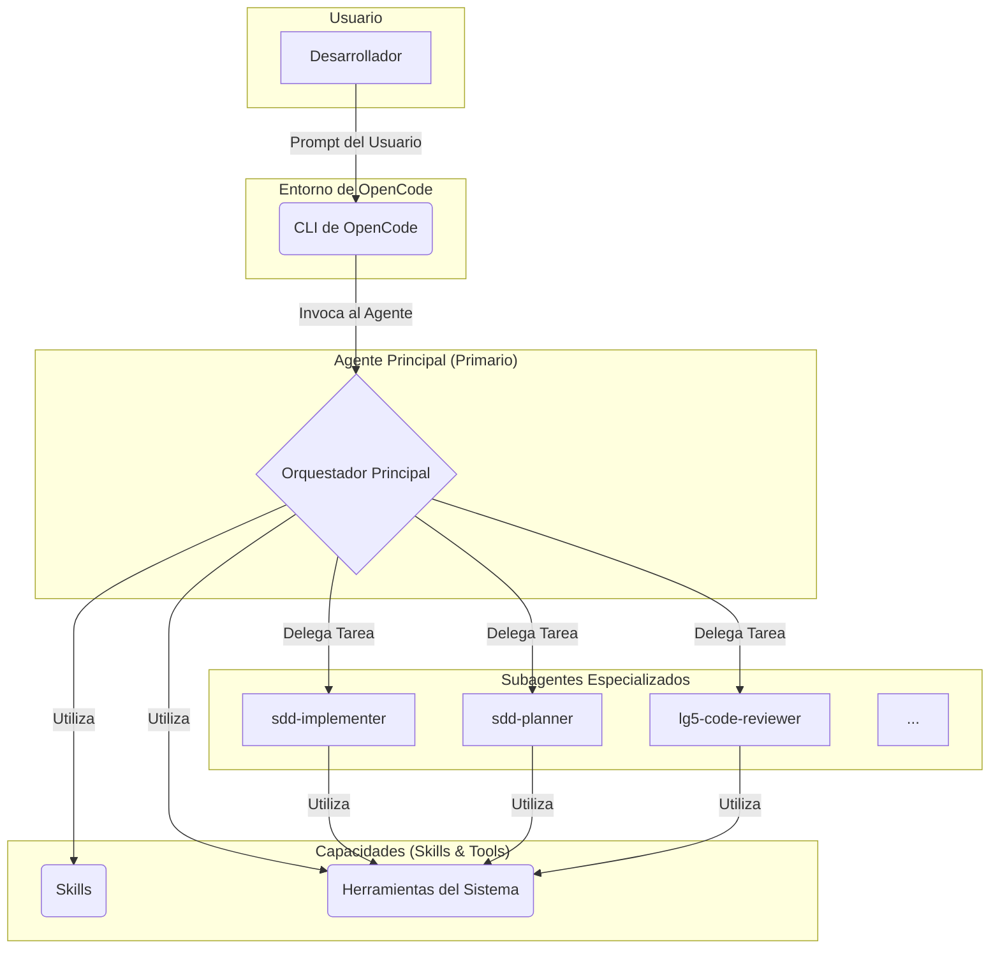

# Arquitectura de Agentes

La arquitectura de `lg5-spring-agent-os` sigue un modelo jerárquico y modular, diseñado para la especialización y la eficiencia.

## Diagrama de Flujo

El siguiente diagrama ilustra cómo interactúan los diferentes componentes del sistema, desde el usuario hasta los subagentes y las herramientas.

## Componentes

### 1. Usuario (Desarrollador)
El punto de partida. El desarrollador interactúa con el sistema a través de un cliente, como la CLI de OpenCode, proporcionando instrucciones en lenguaje natural.

### 2. Entorno de OpenCode
Actúa como la interfaz entre el usuario y los agentes. Gestiona la sesión, la entrada/salida, y la invocación de los agentes correspondientes.

### 3. Agente Principal (Primario)
Es el orquestador general. Recibe la solicitud del usuario desde OpenCode y decide cómo abordarla. Puede realizar tareas simples directamente o delegar trabajos complejos a subagentes especializados. También tiene acceso a un conjunto de *skills* (habilidades) y herramientas básicas del sistema.

### 4. Subagentes Especializados
Son agentes expertos en dominios específicos, como:
-   **`sdd-implementer`**: Ejecuta tareas de implementación de código.
-   **`sdd-planner`**: Crea planes de arquitectura basados en especificaciones.
-   **`lg5-code-reviewer`**: Revisa el código en busca de violaciones de las reglas constitucionales.

Estos subagentes son invocados por el agente principal para realizar tareas que requieren un conocimiento profundo en un área particular.

### 5. Capacidades (Skills & Tools)
-   **Skills**: Son conjuntos de instrucciones y conocimientos predefinidos para tareas específicas (p. ej., `lg5-saga`, `lg5-outbox`). Proporcionan un flujo de trabajo guiado para el agente.
-   **Herramientas del Sistema**: Son las acciones atómicas que un agente puede realizar, como leer un archivo (`read`), escribir en un archivo (`write`), o ejecutar un comando de shell (`bash`).
