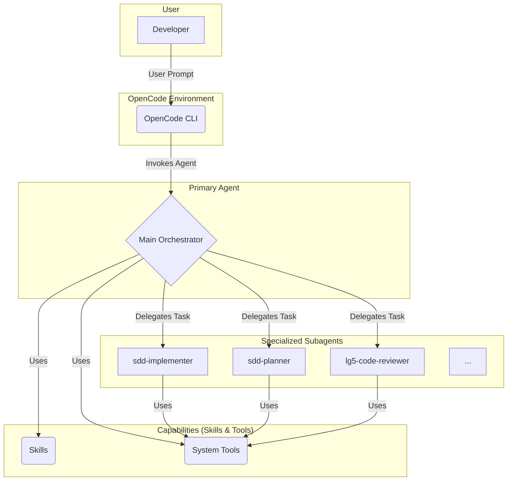

# Agent Architecture

The `lg5-spring-agent-os` architecture follows a hierarchical and modular model, designed for specialization and efficiency.

## Flow Diagram

The following diagram illustrates how the different components of the system interact, from the user to the subagents and tools.

## Components

### 1. User (Developer)
The starting point. The developer interacts with the system through a client, such as the OpenCode CLI, providing instructions in natural language.

### 2. OpenCode Environment
Acts as the interface between the user and the agents. It manages the session, input/output, and the invocation of the corresponding agents.

### 3. Primary Agent
This is the general orchestrator. It receives the user's request from OpenCode and decides how to address it. It can perform simple tasks directly or delegate complex jobs to specialized subagents. It also has access to a set of skills and basic system tools.

### 4. Specialized Subagents
These are expert agents in specific domains, such as:
-   **`sdd-implementer`**: Executes code implementation tasks.
-   **`sdd-planner`**: Creates architectural plans based on specifications.
-   **`lg5-code-reviewer`**: Reviews code for violations of the constitutional rules.

These subagents are invoked by the primary agent to perform tasks that require deep knowledge in a particular area.

### 5. Capabilities (Skills & Tools)
-   **Skills**: These are predefined sets of instructions and knowledge for specific tasks (e.g., `lg5-saga`, `lg5-outbox`). They provide a guided workflow for the agent.
-   **System Tools**: These are the atomic actions that an agent can perform, such as reading a file (`read`), writing to a file (`write`), or executing a shell command (`bash`).
