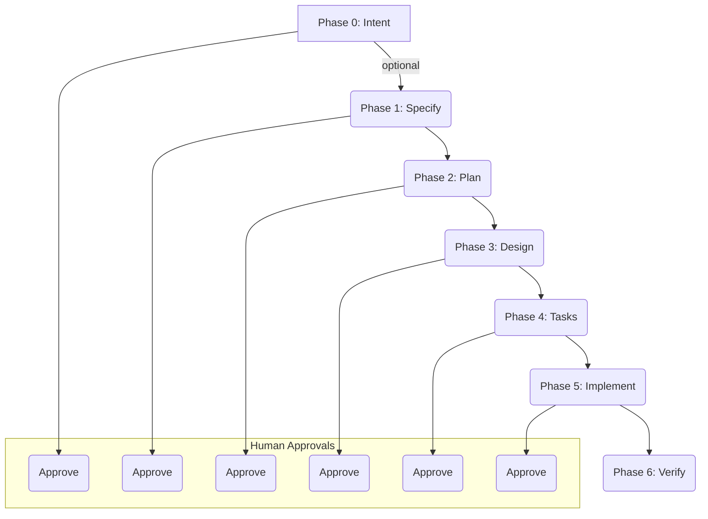

# Spec-Driven Development (SDD) Workflow

This document outlines the Spec-Driven Development (SDD) workflow, a structured approach to software development that emphasizes the importance of specifications.

## Full SDD Workflow

The full SDD workflow is a comprehensive process that takes a feature from an idea to a verified implementation. It consists of seven phases, each with a specific set of artifacts and approvals.

### Phases

1.  **/sdd-intent (Optional)**: This phase is for framing an informal idea into a one-page intent document. It clarifies the "why", "who", "what", and "what not" of the feature.

2.  **/sdd-specify**: In this phase, an informal prompt or an approved intent is converted into a functional Product Requirements Document (PRD). This document is tech-free and focuses on the functional requirements.

3.  **/sdd-plan**: The approved PRD is used to generate a `plan.md` and Architecture Decision Records (ADRs). This phase focuses on the architecture of the feature.

4.  **/sdd-design**: This phase produces a `design.md` and `data-model.md`, which include detailed contracts, schemas, and configurations.

5.  **/sdd-tasks**: The design is decomposed into atomic tasks with Given/When/Then acceptance criteria.

6.  **/sdd-implement**: In this phase, one task is executed at a time, including code, tests, and a commit.

7.  **/sdd-verify**: The final phase involves cross-checking every acceptance criterion against test evidence and making a gate decision. This phase is mandatory and blocks the spec closure unless a `tech-debt` ADR is created.
