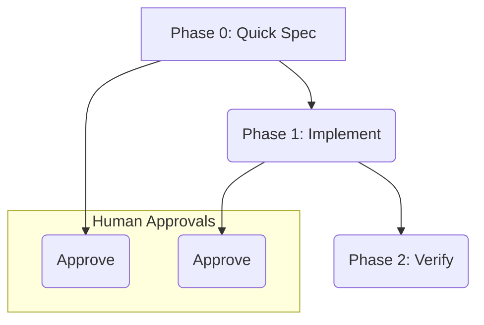

# SDD Quick-Path Workflow

The SDD Quick-Path is a streamlined workflow for trivial changes. It is a compressed version of the full SDD workflow, designed to be fast and efficient for small changes.

## Quick-Path Workflow

The Quick-Path workflow consists of three phases:

### Eligibility

The Quick-Path is only for trivial changes, such as:

*   1 endpoint
*   1 entity
*   1 listener
*   1 field
*   1 config

The `/sdd-quick` command enforces a 10-criterion eligibility gate. Sagas, new outboxes, new aggregates, new Avro schemas, multi-module changes, and breaking API changes are all rejected and routed to the full path.

### Phases

1.  **/sdd-quick**: This command generates a compressed `quick-spec.md` for trivial changes. It replaces the Specify, Plan, Design, and Tasks phases of the full workflow.

2.  **/sdd-implement**: In this phase, the code is implemented and tested.

3.  **/sdd-verify**: The final phase is to verify the changes. This phase is mandatory.
